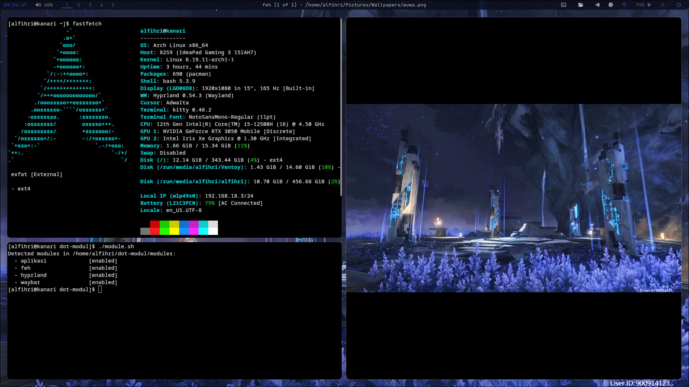

# dot-modul

`dot-modul` is a modular dotfiles setup for Arch Linux style desktops.
The idea is simple: every feature lives in its own module, so you can install only the parts you actually want.





## What this repo is about

This project is built around small installable modules.
Each module can define:

- packages to install with `pacman`
- optional AUR packages installed via `yay`
- system or user services to enable
- config files to symlink into `~/.config`
- custom setup hooks before or after the module runs

So instead of one giant monolithic setup script, you get something that is easier to read, change, and reuse.

## Current modules

These modules are currently detected from the [`modules/`](modules) directory:

| Module | What it does |
| --- | --- |
| `aplikasi` | Base desktop services and apps like networking, Bluetooth, and PipeWire audio |
| `hyprland` | Hyprland desktop setup, wallpaper automation, restart helpers, and related config |
| `waybar` | Waybar config plus the package list used by this setup |

Folders that start with `_`, like [`modules/_template`](modules/_template), are treated as internal templates and ignored by the installer.

## Requirements

This repo is currently designed for:

- Arch Linux or an Arch-based distro
- `bash`
- `pacman`
- `systemd`
- `sudo`

If a module uses AUR packages, the installer can bootstrap `yay` automatically when needed.

Do not run the installer as `root`.

## Quick start

```bash
git clone https://github.com/Alfihri12/dot-modul.git
cd dot-modul
./install.sh
```


When you run `./install.sh` in a terminal, the script will:

1. detect every valid module inside `modules/`
2. show which modules are currently enabled
3. let you pick modules by number or by name
4. install packages, enable services, and link config files

If you just press Enter, it installs all enabled modules.

## Installer examples

Install with the interactive picker:

```bash
./install.sh
```

Install every enabled module without a prompt:

```bash
./install.sh --all
```

Install only specific enabled modules:

```bash
./install.sh --modules hyprland,waybar
```

You can also select modules by index:

```bash
./install.sh --modules "1 3"
```

The numeric indexes follow the current enabled module list shown by the installer.

Show detected modules and their status:

```bash
./install.sh --list-modules
```

Skip the prompt and just install all enabled modules:

```bash
./install.sh --no-prompt
```

## Enable or disable modules

Modules are enabled by default.
If you want to temporarily skip a module without deleting its folder, use [`module.sh`](module.sh):

```bash
./module.sh list
./module.sh disable waybar
./module.sh enable waybar
```

Available commands:

- `./module.sh list`
- `./module.sh status`
- `./module.sh enable <module...>`
- `./module.sh disable <module...>`

When you disable a module in an interactive terminal, the flow is:

1. mark the module as disabled
2. ask whether the module config should be unlinked from `~/.config`
3. if you answer yes, ask whether the module packages and services should be uninstalled

This means you can use the same command for a few different outcomes:

- disable only: keep the current configs and installed apps as-is
- disable + unlink: remove the symlinks for that module config, but keep packages installed
- disable + unlink + uninstall: remove module-owned packages and disable its services, but keep the module folder in this repo

The uninstall step only removes packages and disables services declared by the module.
It does not delete anything inside [`modules/`](modules).

If `./module.sh disable ...` runs in a non-interactive shell, it only updates the enabled or disabled state and skips the unlink and uninstall prompts.

Disabled module names are stored in:

```text
$XDG_STATE_HOME/dot-modul/disabled-modules
```

If `XDG_STATE_HOME` is not set, that usually becomes:

```text
~/.local/state/dot-modul/disabled-modules
```

## How modules are detected

A folder is treated as a module when:

- it lives directly inside [`modules/`](modules)
- its name does not start with `_`
- it contains a `module.conf` file

That means you can drop in a new module folder and the installer will pick it up automatically.

## What happens during installation

For each selected module, the runner will:

1. load `module.conf`
2. load `custom.sh` if it exists
3. install `MODULE_PACKAGES`
4. install `MODULE_AUR_PACKAGES`
5. enable `MODULE_SYSTEM_SERVICES`
6. enable `MODULE_USER_SERVICES`
7. symlink files from the module `config/` folder into `~/.config`

If a config file already exists, it is backed up with a `.bak.<timestamp>` suffix before the symlink is created.

The installer also writes logs to [`install.log`](install.log).

## What happens during module cleanup

When you choose unlink or uninstall from `./module.sh disable <module>`:

1. config entries from the module `config/` directory can be unlinked from `~/.config`
2. system services from `MODULE_SYSTEM_SERVICES` can be disabled
3. user services from `MODULE_USER_SERVICES` can be disabled
4. packages from `MODULE_PACKAGES` can be removed
5. AUR packages from `MODULE_AUR_PACKAGES` can be removed

Unlink is conservative:

- matching symlinks created from the module config are removed
- regular files are left alone
- symlinks pointing somewhere else are left alone

## Repo layout

```text
.
├── assets/
├── core/
├── docs/
├── modules/
├── install.sh
└── module.sh
```

## More docs

- [Module guide](docs/modules.md)
- [Hyprland features](docs/hyprland.md)

## Hyprland extras

The Hyprland module now includes a few quality-of-life scripts on top of the base config:

- automatic wallpaper rotation from `~/Pictures/Wallpapers`
- optional pywal refresh when the wallpaper changes
- a restart selector for panel scripts inside `~/.config/hypr/scripts/restart`

Default shortcuts:

- `SUPER_SHIFT + N`: change wallpaper once and refresh pywal-aware apps
- `SUPER_SHIFT + M`: open the restart selector for panel scripts

If you want the details, command examples, wallpaper flow, or the full keybind list, check [docs/hyprland.md](docs/hyprland.md).

## Notes

- Wallpaper assets are copied into `~/Pictures/Wallpapers` if that directory is empty.
- This setup is still very easy to customize because each module owns its own package list and config files.
- If you only want a few pieces of the setup, that is totally fine. Pick what you need and ignore the rest.
